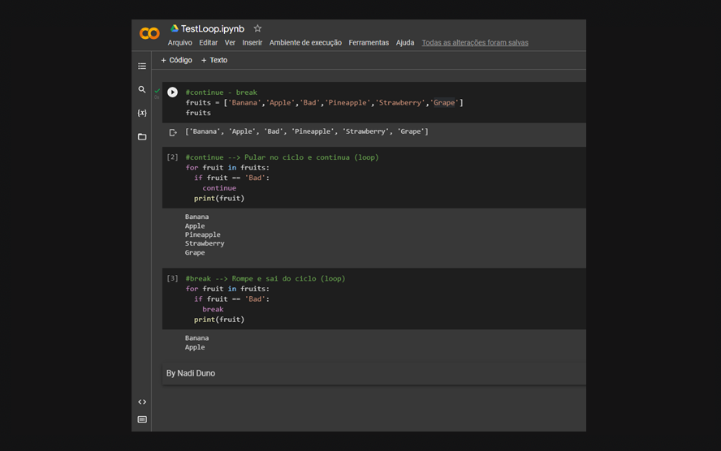

[](https://portfolio-nadi.vercel.app/)
[](https://twitter.com/nadiduno)
[](https://www.linkedin.com/in/nadiduno/)
<br />
<br />
Alguns link de arquivos de Colab com códigos em python, para compartilhar com a comunidade migrante 💛💙❤️ :ven:
<br />
<div align="center">
  
  <br />
</div>

<br/>
[Python](https://www.python.org/) 


```python
#Diferença entre usar CONTINUE E BREAK no Loop

#Declarando e definiedno as frutas em um array
fruits = ['Banana','Apple','Bad','Pineapple','Strawberry','Grape']
#continue --> Pula no ciclo (loop) e continua 
for fruit in fruits:
  if fruit == 'Bad':
    continue
  print(fruit)
#break --> Rompe e sai do ciclo (loop)
for fruit in fruits:
  if fruit == 'Bad':
    break
  print(fruit)
```
📎LINKS
#Exemplos para principiantes
https://colab.research.google.com/gist/nadiduno/57fe602846dc7c75c06784121f190c2a/python-aulastoti.ipynb#scrollTo=G2WFW1isAkPs

#Variaves primitivas e compostas em python
https://colab.research.google.com/drive/1PIfkvuO42hCJ0a1jKdTFyeW_qJIgBAz1

#Gabaritos em PYTHON
https://colab.research.google.com/gist/nadiduno/c7513c4ab9c14dee9b43d79f8b06ec8e/gabaritodesafio.ipynb#scrollTo=trBNvubLh8oD

#Usando CONTINUE e BREAK
https://colab.research.google.com/drive/1gjXVkFbw2aeeiw-ZiNqH2cC5XGyIcRaN

🎦 VIDEO
https://www.youtube.com/watch?v=EBaUEAxuC2o

#Teste de Python
https://github.com/nadiduno/linkColabGoogle/blob/main/testepythonnadi.ipynb


Prácticas do modulo de Python 💻 [Toti](https://totidiversidade.com.br/) 

Feito com <💜 /> DevRel [Nadi Duno](https://www.linkedin.com/in/nadiduno/) | [Embaixadora da Toti Diverdidade] (https://totidiversidade.com.br/) © 2022
